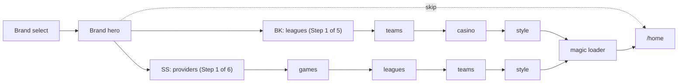

# Onboarding Flow

The onboarding wizard screens and how they connect.

## Screen List

| Step | Route | Brand | Description |
|------|-------|-------|-------------|
| Brand select | `/onboarding` | Both | Choose BetKing or SuperSportBET |
| Hero | `/onboarding/hero` | Both | Brand-themed welcome screen with Get Started CTA |
| Providers | `/onboarding/providers` | SS only | Pick game studios |
| Games | `/onboarding/games` | SS only | Pin favourite games from selected providers |
| Leagues | `/onboarding/leagues` | Both | Select football leagues |
| Teams | `/onboarding/teams` | Both | Choose clubs from selected leagues |
| Casino | `/onboarding/casino` | BK only | Pin up to 4 casino games |
| Style | `/onboarding/style` | Both | Risk preference, session style, promo preferences |
| Magic | `/onboarding/magic` | Both | Loading animation, saves preferences, redirects to /home |

## Flow Diagram

> The hero is **not** counted in pip progress. The first pip-counted step is leagues (BK) or providers (SS).

## Step Guards

Each step page checks two conditions on mount:

1. **Brand is set** -- if `state.brand` is null the user has not started the wizard. Redirect to `/onboarding`.
2. **Step is in flow** -- the page calls `isStepInFlow(brand, stepKey)`. If the step is not part of the current brand's flow (e.g. a BK user hitting `/onboarding/providers`), redirect to `/onboarding`.

This prevents users from navigating to steps that do not apply to their selected brand and ensures the wizard is always entered from the beginning.

## Navigation Helpers

- `getNextStep(brand, currentStep)` returns the next step key or `null` at the end.
- `getPreviousStep(brand, currentStep)` returns the previous step key or `null` at the start.
- `getStepIndex(brand, step)` returns the zero-based position in the full flow (used for internal comparisons).
- `getStepCount(brand)` returns the total number of steps in the full flow.
- `getWizardStepIndex(brand, step)` returns the 1-based pip position, excluding `brand` and `hero` meta steps.
- `getWizardStepCount(brand)` returns the pip denominator (5 for BK, 6 for SS).

---

See also: [architecture.md](architecture.md), [database.md](database.md)
