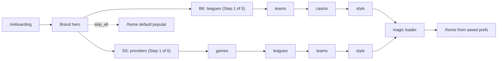

# Onboarding Flow

The onboarding wizard screens and how they connect.

## Screen List

| Step | Route | Brand | Description |
|------|-------|-------|-------------|
| Entry | `/onboarding` | Both | Redirects to `/onboarding/hero` |
| Hero | `/onboarding/hero` | Both | Brand-themed welcome screen with Get Started CTA |
| Providers | `/onboarding/providers` | SS only | Pick game studios |
| Games | `/onboarding/games` | SS only | Pin favourite games from selected providers |
| Leagues | `/onboarding/leagues` | Both | Select football leagues |
| Teams | `/onboarding/teams` | Both | Choose clubs from selected leagues |
| Casino | `/onboarding/casino` | BK only | Pin up to 4 casino games |
| Style | `/onboarding/style` | Both | Risk preference, session style, promo preferences |
| Magic | `/onboarding/magic` | Both | Loading animation, writes preferences to **localStorage**, redirects to `/home` |

## Continue vs Skip for now

- **Continue** stays **disabled until** that step expects a minimal choice from the user (e.g. at least one league, provider, game, team, or casino pick; style screen requires **both** risk and session before Continue enables — unchanged from before).
- **Skip for now** (ghost button) moves forward **without** requiring those selections. It never jumps straight to `/home`.
- **Linked screens** (skip jumps past the dependent step):
  - **Providers (SuperSport)** → next route is **leagues** (**games** is skipped in one action).
  - **Leagues (BetKing)** → next route is **casino** (**teams** is skipped).
  - **Leagues (SuperSport)** → next route is **style** (**teams** is skipped).
- On all **other** preference steps, Ghost advances exactly **one** step (`getNextStep`).

Users can satisfy one step via Continue and use Skip on later steps until they reach magic; partially filled state is still written when they save at the end.

## Flow Diagram

> The hero is **not** counted in pip progress. The first pip-counted step is leagues (BK) or providers (SS).

## Persistence (localStorage)

- While the user is on `/onboarding/*`, `OnboardingContext` writes the current `OnboardingState` to **localStorage** whenever state **changes** (e.g. toggles). Navigating between steps without changing state does not overwrite storage.
- **MagicLoader** writes the full snapshot again before redirecting to `/home` (no Supabase/API call in this phase).
- **Skip personalisation** on the hero goes to `/home` without going through magic; existing stored prefs are left as-is (or never written on that path), and the home screen shows the **default “popular”** carousel when there are no meaningful saved preferences.

## Step Guards

Each step page checks **step is in flow** — the page calls `isStepInFlow(brand, stepKey)`. If the step is not part of the current brand's flow (e.g. a BK user hitting `/onboarding/providers`), redirect to `/onboarding`.

## Navigation Helpers

- `getNextStep(brand, currentStep)` returns the next step key or `null` at the end.
- `getGhostSkipDestination(brand, currentStep)` (`src/lib/flow.ts`) returns where **Skip for now** navigates, including linked skips (providers→leagues for SS; leagues→casino BK / →style SS).
- `getPreviousStep(brand, currentStep)` returns the previous step key or `null` at the start.
- `getStepIndex(brand, step)` returns the zero-based position in the full flow (used for internal comparisons).
- `getStepCount(brand)` returns the total number of steps in the full flow.
- `getWizardStepIndex(brand, step)` returns the 1-based position for the header label, excluding `hero` and `magic` (brand hero + post-preferences loader).
- `getWizardStepCount(brand)` returns that denominator (4 for BK, 5 for SS — interactive preference steps only).
- `goToNextPreferenceStep(router, brand, step)` (`src/lib/onboardingNav.ts`) implements **Skip for now** via `getGhostSkipDestination` and `STEP_ROUTES`.

---

See also: [architecture.md](architecture.md), [database.md](database.md)
